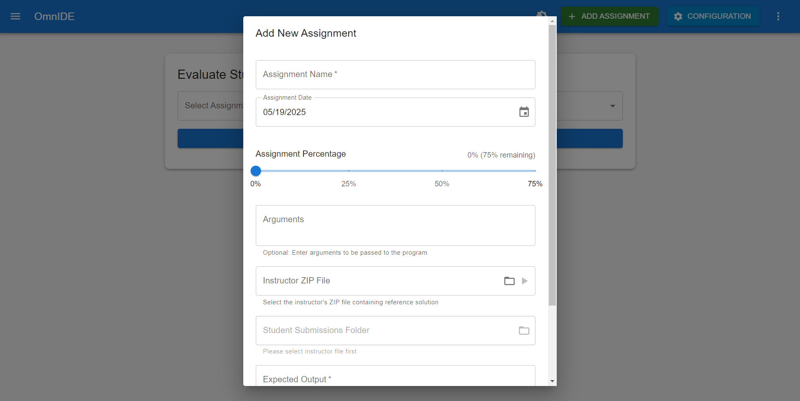
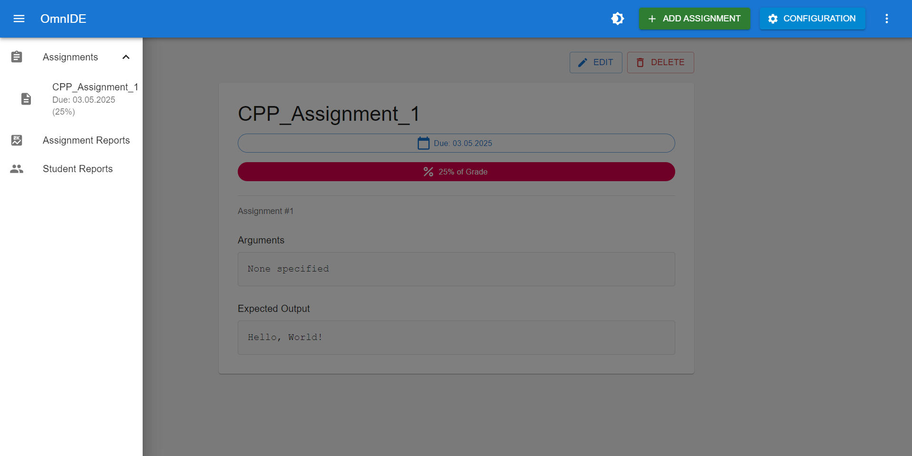
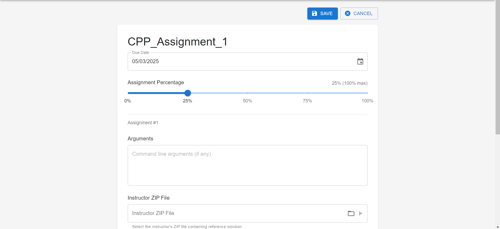
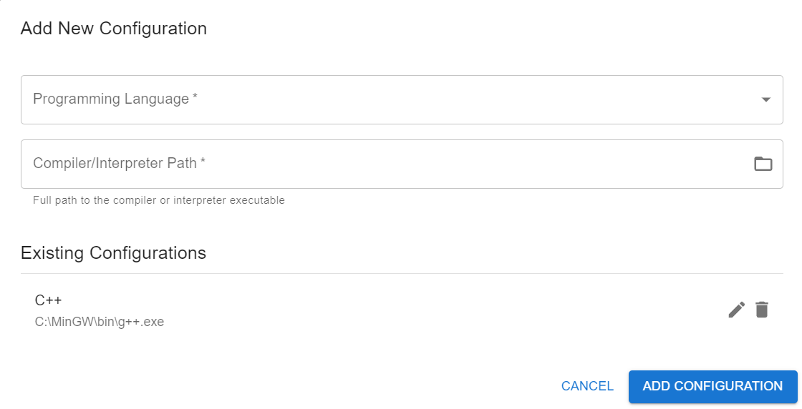
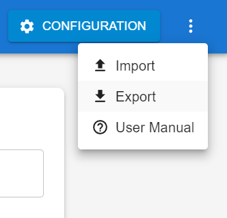
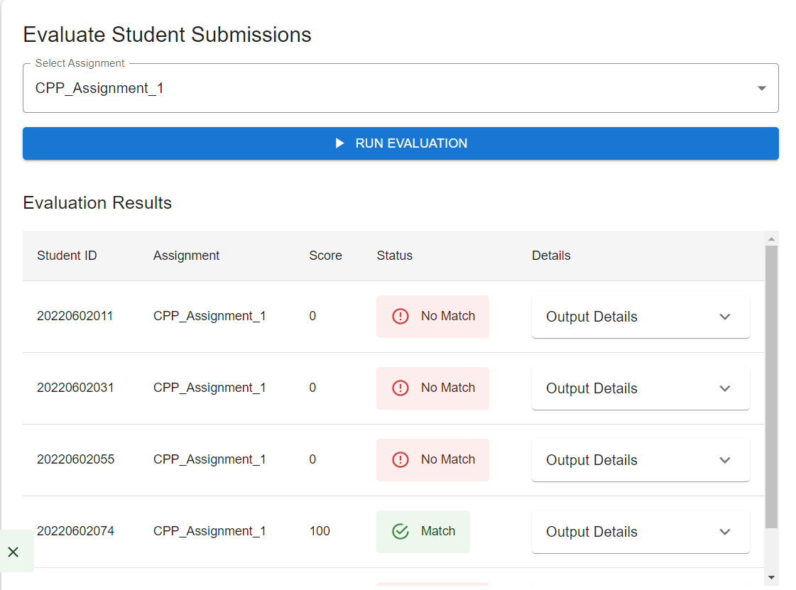
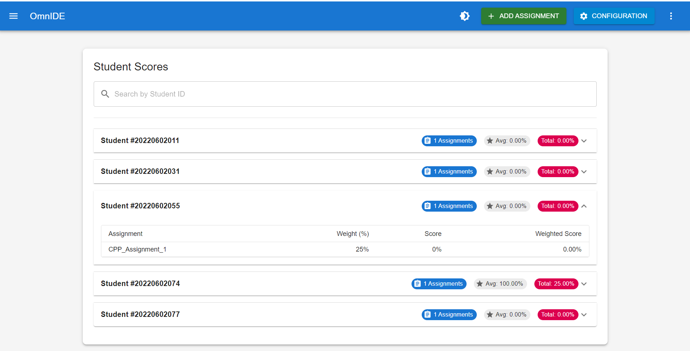

# OmnIDE
Programming Assignment Management Environment

## 📋 Overview

OmnIDE is an integrated development and evaluation environment designed to manage programming assignments, assess student submissions, and track results in educational settings.

## ✨ Features

### Assignment Management
- Create, edit, and view assignments with:
  - Assignment name
  - Due date
  - Weight percentage
  - Reference solution
- Import student submissions in ZIP format
- Track assignment progress and results
- Define expected outputs for automated evaluation

&nbsp;

&nbsp;

&nbsp;

### Configuration Management
- Create language configurations with:
  - Compiler/interpreter paths
  - Command-line arguments
  - Execution parameters
- Support for multiple programming languages:
  - Java, C, C++, Python, JavaScript, C#, Go
- Import/export configurations between systems
- Reuse configurations across assignments

&nbsp;

&nbsp;

### Evaluation System
- Batch process student submissions
- Automatically compile and execute code
- Compare outputs with reference solutions
- Score assignments based on output matching
- View detailed evaluation results

&nbsp;

### Result Tracking
- View student scores across assignments
- Track assignment completion percentages
- Examine individual submission details
- Export results for grading systems
- View statistical summaries of class performance

&nbsp;

&nbsp;

## 🛠️ Technology Stack

| Component | Technology |
|-----------|------------|
| Frontend  | React with TypeScript, Material-UI and Tailwind CSS |
| Backend   | Python API with FastAPI |
| Database  | SQLite |
| Packaging | Electron for cross-platform desktop application |
| Build Tools | Vite |

## 🚀 Getting Started

### Prerequisites
- Node.js
- Python 3.13+
- npm or yarn

### Installation
1. Clone the repository

2. Install frontend dependencies:
   ```bash
   npm install
   ```

3. Install Python dependencies:
   ```bash
   pip install -r requirements.txt
   ```

### Running the Application

1. Start the backend and frontend development server:
   ```bash
   npm run dev
   ```

### Building for Production
To create a standalone Electron application:
```bash
npm run build
```


### Setup 
You can reach the latest setup file at the releases section.


## 📝 Usage
- Create assignments with reference solutions
- Import student submissions
- Run evaluations to compare student output against expected results
- Export data for backup or transfer to another system

## 📚 Documentation
For more detailed information, click the Help icon in the application to access the built-in user manual.

## Documents
[Link to the Design Document(PDF)](./docs/OmnIDE_Design_Doc.pdf)

## Contributors
- Mert Koğuş "DeveloperLabb"
- Beyazıt Tur "Heliacaa" 
- Ediz Arkın Kobak "EdizArkin"
